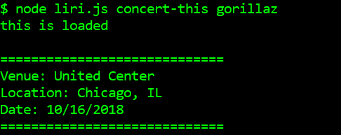
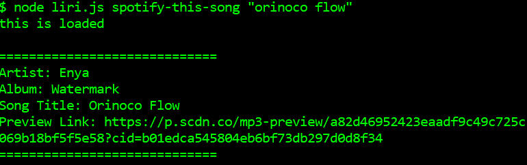
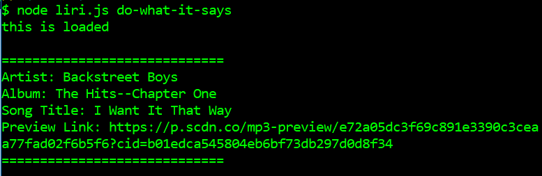

# Liri - Your node.js personal assistant

Liri is a node.js based personal assistant who can help find concert dates, song information, movie data, and more!

### Functions

* Enter `node liri.js concert-this <artist/band name here>` to find the next concert by that artist or band

* Enter `node liri.js spotify-this-song '<song name here>'` to find Spotify information for your favorite song

* Enter `node liri.js movie-this '<movie name here>'` to pull up data for your favorite film

* Enter `node liri.js do-what-it-says` to put your faith in the file system and see what it searches for you

